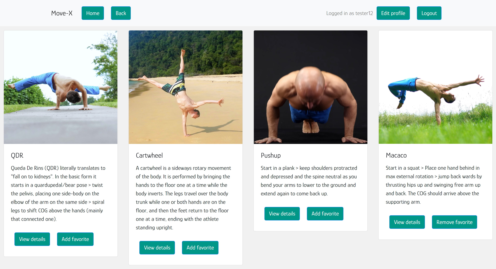

# MoveX-client
MoveX is a library of movements from various styles and traditions, with descriptions/cues and video sources.

This is the React-based frontend - A single-page, responsive web application (SPA), built following the MVC design pattern.

Find the backend (REST API using MongoDB) here: [MoveX backend](https://github.com/MitoMonkey/MoveX-backend)

API and client were created as a study project during my Fullstack Web-developer course @CareerFoundry.

## Live Demo
[Live app](https://move-x.netlify.app/)

## User storys
* As a user, I want to be able to receive information on moves, progressions and instructions so that I can find inspiration, learn new skills and develop my movement vocabulary. 
* As a user, I want to be able to create a profile so I can save my favorite moves.

## Features
* View a list of all moves
* Filter list by name (through a text input)
* See details for each move
* See details about a style
* See details about a source
* Allow new users to register 
* Allow users to update their user info (username, password, email, date of birth)
* Allow users to add a move to their list of favorites/projects
* Allow users to remove a move from their list of favorites 
* Allow existing users to deregister 

## Built With
- Javascript, HTML, CSS
- React
- React Bootstrap as a UI library for styling and responsiveness
- React Redux (respecting the Flux pattern)
- a mix of class components and functional components
- axios to make AJAX requests to the API
- build tool: Parcel
- PropTypes for data validation between the components

## Usage
Set up the project with all dependencies: `npm install` (in project folder).

## Deployment
To build the project run `npx parcel src/index.html` from the project folder.

In my version the GitHub repo is linked to the Netlify hosting. Pushing to the main branch automatically updates the live version.

## Things to further improve/add
* Modals instead of "alert"s
* Registration view & edit profile form
    * Confirm password (input a second time to avoid typos)
    * `setUsernameInvalid('This username is already taken.');` > needs to be based on the server response
* ProfileView
    * Enter password (in modal) to confirm deletion user account
    * Confirm (old) password for changing user data
* FloatingLabels in Forms (Seems to be a feature of react@next only…)

## 🤝 Contributing

Contributions, issues, and feature requests are welcome!
Feel free to check the [issues page](https://github.com/MitoMonkey/MoveX-client/issues).
